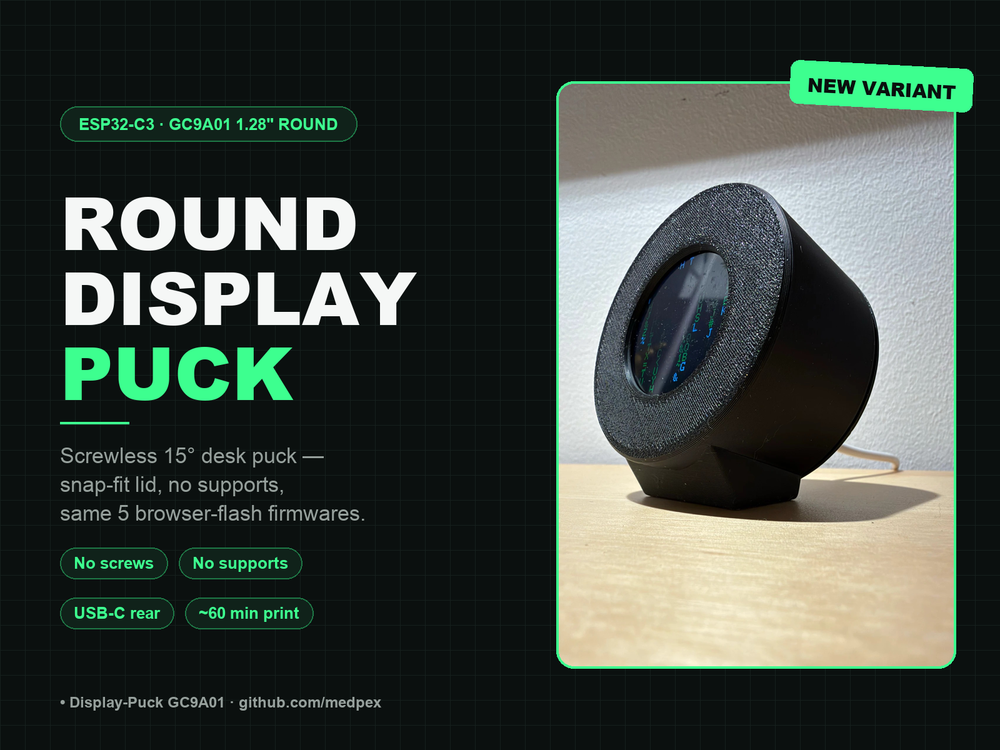
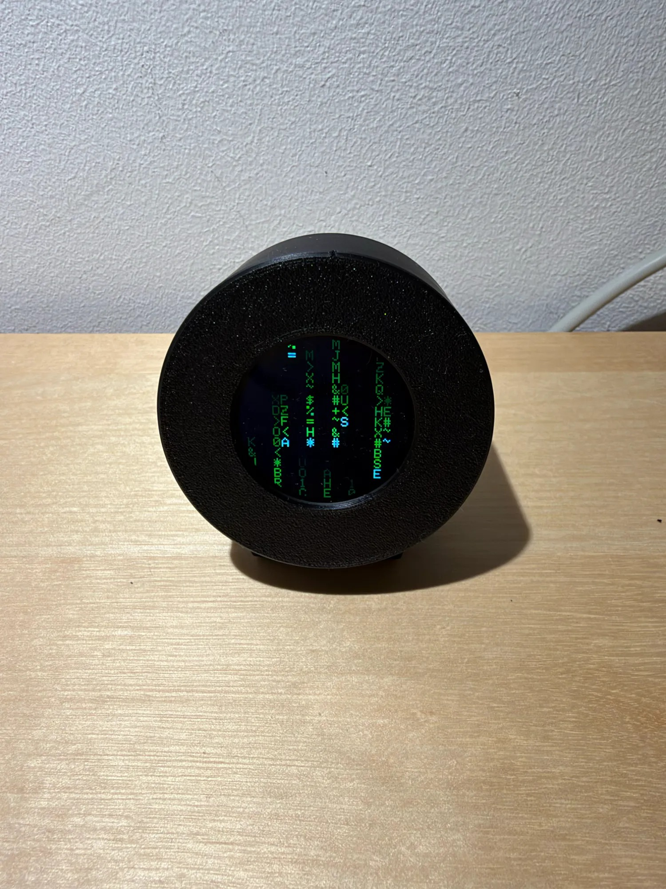
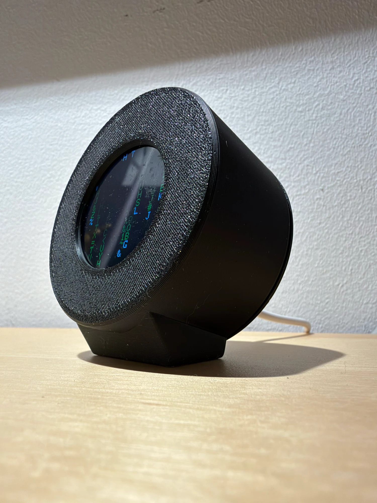
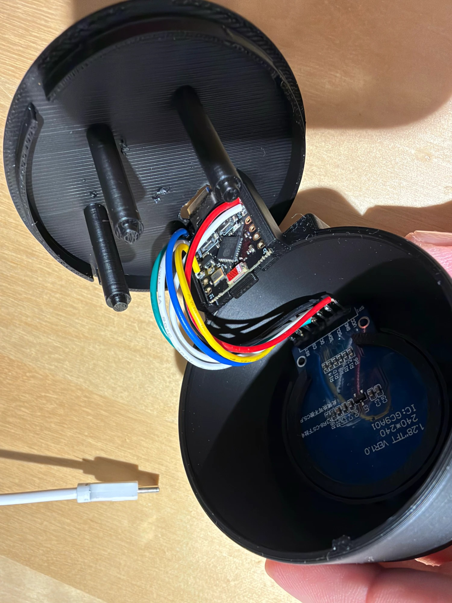
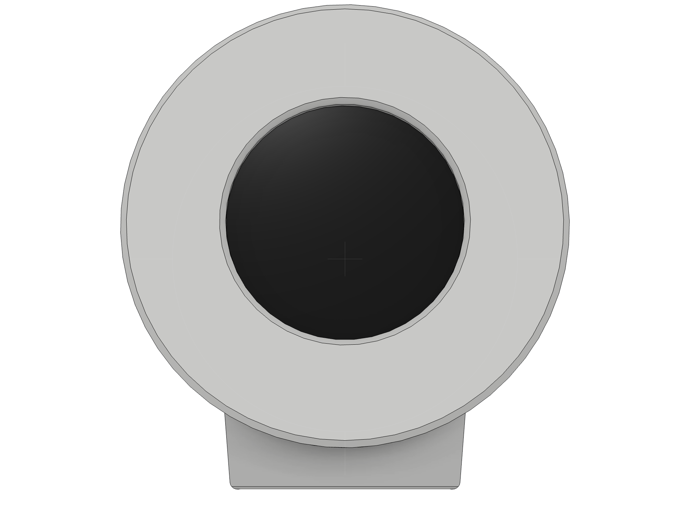
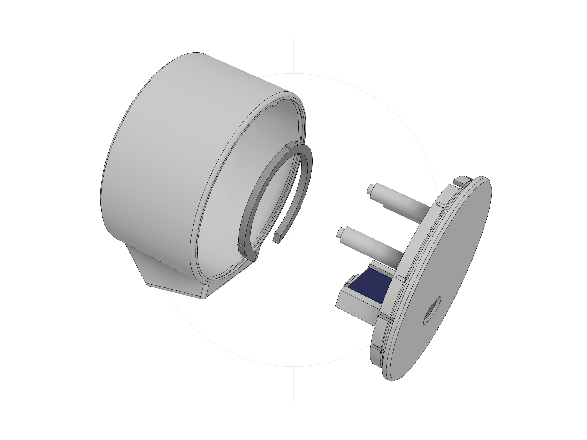
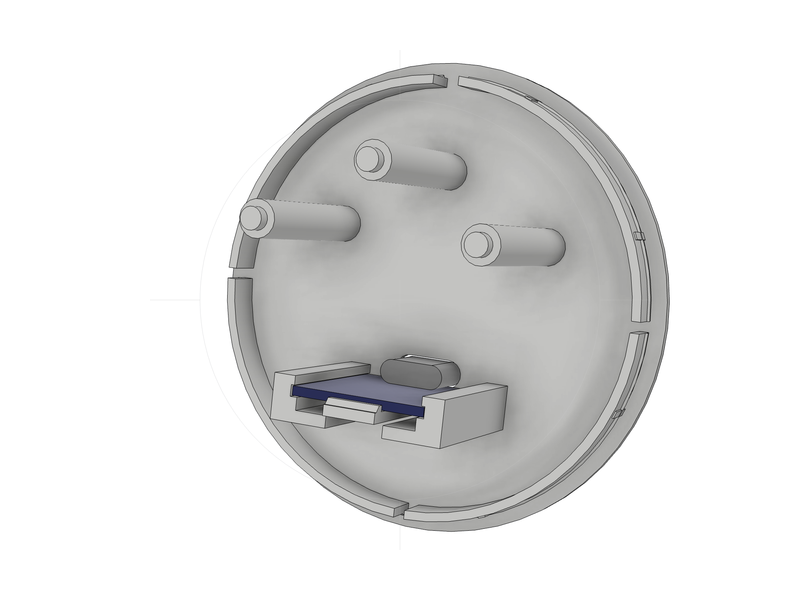
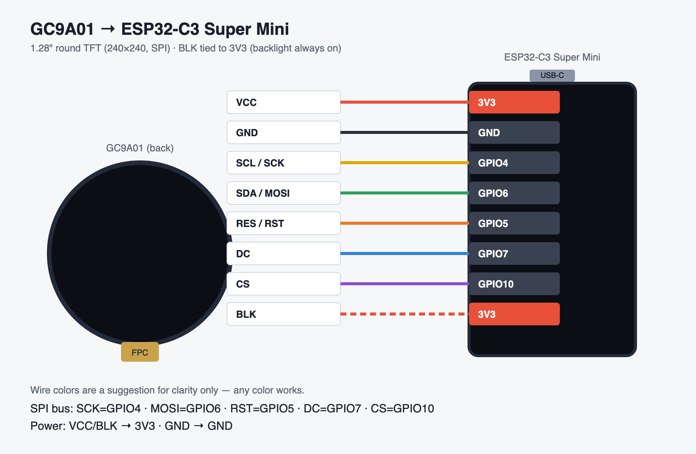

# Display-Puck GC9A01 — Round 15° Desk Puck

A round, 15°-tilted desk puck for a **GC9A01 1.28" round TFT** (240×240, SPI) with an
integrated **ESP32-C3 Super Mini**. It is a variant of
[Display-Case GC9A01](https://makerworld.com/de/models/3082754-tischstander-fur-gc9a01-1-28-display-esp32-c3)
and uses the same electronics, wiring and firmware, in a puck-shaped housing with an
integrated wedge foot. USB-C comes out the back. No screws, no supports.

This folder is part of the [display-case-gc9a01](../README.md) repo. Firmware, web flasher
and wiring diagram live in the repo root.



| Front | Angle | Inside (lid v2 with ESP32 sled) |
|---|---|---|
|  |  |  |

> **Firmware:** same as the original — flash it from your browser with the
> **[Web Flasher](https://medpex.github.io/display-case-gc9a01/)** (Chrome/Edge, desktop).
> The display sits in the same orientation (chin down), so every firmware works unchanged.

| Render | Exploded | Lid v2 with ESP32-C3 |
|---|---|---|
|  |  |  |

## Key data

| | |
|---|---|
| Size | ⌀64 × 36 mm puck (incl. lid); standing ~72 mm high × ~52 mm deep |
| Tilt | 15° backwards |
| Parts | 3 (housing, lid, clamp ring) |
| Filament | ~36 g PLA (Bambu Studio, A1 0.4, 4 walls, 15 % gyroid) |
| Print time | ~60 min on a Bambu Lab A1 (all 3 parts, one plate); lid alone ~31 min |
| Supports | none |
| Fasteners | none — clamp ring held by 3 posts on the lid, snap-fit lid, snap sled for the ESP32 |

## Contents

```
puck/
├── STL/                          # print-ready meshes, already in print orientation
│   ├── PUCK-Gehaeuse.stl         # housing (front face down)
│   ├── PUCK-Deckel.stl           # lid with ESP32 holder (outer face down)
│   └── PUCK-Klemmring.stl        # clamp ring
├── 3MF/PUCK-alle-teile.3mf       # all parts on one plate (from tools/make_print_files.py)
├── 3MF/PUCK-BambuStudio-A1.3mf   # Bambu Studio project, sliced for A1 (all parts)
├── 3MF/PUCK-Deckel-v2-BambuStudio-A1.3mf # lid v2 only (reprint)
├── 3MF/PUCK-Druckplatte-Fusion.3mf # same plate, exported straight from Fusion
├── STEP/                         # CAD per part + assembly (assembled position)
├── fusion/
│   ├── build_puck.py             # parametric Fusion model (source of truth)
│   ├── Display-Puck-GC9A01.f3d   # Fusion archive
│   ├── layout_print.py           # lay all parts side by side on the plate (+ 3MF export)
│   ├── view_puck.py / render_puck.py / check_interference.py / rebuild.py
├── tools/
│   ├── make_print_files.py       # STL -> print orientation, 3MF, STEP, mesh checks
│   └── make_covers.py            # MakerWorld covers from the Fusion renders
├── docs/img/                     # renders + covers
├── BOM.md                        # bill of materials
└── MAKERWORLD.md                 # listing kit (DE/EN)
```

## Wiring (GC9A01 → ESP32-C3 Super Mini)

Identical to the original case.

| Display | ESP32-C3 GPIO |
|---------|---------------|
| VCC | 3V3 |
| GND | GND |
| SCL / SCK | GPIO4 |
| SDA / MOSI | GPIO6 |
| RES / RST | GPIO5 |
| DC | GPIO7 |
| CS | GPIO10 |
| BLK | 3V3 (backlight always on) |



## Print settings

- **Material:** PLA
- **Layer height:** 0.2 mm
- **Walls:** 4 perimeters (0.4 mm nozzle)
- **Infill:** 15 % gyroid
- **Supports:** none. Two short bridges print without support: the USB-C recess (7 mm) and the snap-hook ceilings (1 mm).
- **Orientation:** the STLs are already oriented. Housing front face down, lid outer face down, ring flat.
- **Brim:** not needed (the housing stands on its full ⌀64 front face)

## Assembly

1. **Display:** insert the display through the open back into the round seat, glass
   first, chin/FPC **down** through the opening between the two locating pins.
2. **Clamp ring:** press the ring in from the back with its opening facing down (FPC).
   Its three ribs press-fit into the pocket.
3. **Wiring:** wire the display to the ESP32-C3 using the table above. On the display,
   use a straight header pointing backwards (or solder directly). A right-angle header
   does not fit. On the ESP32, solder directly, or use headers that point towards the
   centre of the puck.
4. **ESP32-C3:** slide the board into the sled on the lid, **USB-C end first**. The
   board rides over the snap tongue underneath until the tongue's nub clicks up behind
   the far end of the board. The USB-C socket now sits in the lid's port. To remove it,
   press the tongue tip down with a small screwdriver and pull the board out.
5. **Lid:** tuck the wires in, line up the lid slot with the key at the top of the
   housing, and press the lid in until the snap bead clicks. The 3 posts on the lid press
   the clamp ring (and the display) forward with 0.3 mm preload.
6. Optional: stick 2 rubber feet (⌀8 mm) under the foot pad.

To open it again, lever the lid out at one of the flex slots with a fingernail or a
plastic spudger.

## Design notes

- **Display mount copied 1:1** from the test-printed original (`CASE-FINAL.step`):
  window ⌀34, glass seat ⌀36 × 1.8, module pocket ⌀39 up to 8 mm, 26 mm chin opening,
  pins ⌀1.5 at (±9.45 / −20.97) for the PCB mounting holes, and the clamp ring
  ⌀38.6/⌀32.8 × 2.2 with 3 press-fit ribs (hull ⌀39.2 in the ⌀39 pocket).
- **Puck ⌀64:** the bore (r 30) clears the module tab corners (r 29.16, tab 23 mm wide,
  7.8 mm below the round PCB) with 0.84 mm to spare.
- **Foot:** the puck's axis is tilted by 15°. Cutting the cylinder flat would eat into the
  inside, so there is a separate wedge foot underneath with a 45° front slope (printable).
  The round cavity stays complete, and the lid rim clears the table by 0.5 mm.
- **Lid (v2):** 5 mm lip slotted in 4 places, 0.1 mm radial clearance plus 8 crush ribs
  (0.1 mm interference; v1 had 0.25 mm and wobbled), and a 45° snap bead that engages a
  groove in the bore, and a key at the top to stop it rotating.
- **ESP32-C3 holder (v2):** rigid U-sled (walls tied together by a floor) plus a flat
  snap tongue under the board centre (0.65 mm travel, ~0.2 % strain). v1 used two
  free-standing 24 mm rails that flexed 0.8 mm across the layer lines; one of them broke
  on the first print. Plugging in a cable pushes the board against the tongue's hook, and
  pulling a cable pushes it against the lid.
- **Display hold-down (v2):** 3 posts on the lid (30°/90°/150°, ⌀5 → ⌀3 tip) press the
  clamp ring against the display PCB (0.3 mm preload, the lid plate flexes). On the
  first print the ring's press fit alone did not hold.
- **Checked:** all parts are closed solids and watertight. A Fusion interference check
  finds no collisions (the only overlap is the intended clamp-ring press fit), ray checks
  through the window and the USB port find no stray material, and the parts slice in
  Bambu Studio without supports.

### Assumptions to verify on the first print

- **ESP32-C3 board 22.6 × 18 × 1.2 mm** (measured; rail slot 1.5 mm). If your board
  rattles, change `PCB_T` / `ESP_L` in `fusion/build_puck.py` and rebuild.
- **Display pin header:** use a **straight** header pointing backwards (Dupont fits) or
  solder the wires directly. A **right-angle header** pointing down (reaches r ≈ 31 mm)
  does **not** fit into the round body.
- **Clamp ring ribs:** if the ring is too tight, sand the ribs lightly. If it is too loose,
  raise `RING_RIB_R` by 0.05.

## Rebuild / edit the CAD

All dimensions are constants at the top of `fusion/build_puck.py`, and the main ones are
also Fusion user parameters.

```bash
# In Fusion: Utilities → Scripts and Add-Ins → + → fusion/build_puck.py → Run
# then regenerate the print files and covers:
python3 tools/make_print_files.py
python3 tools/make_covers.py
```

**Print plate straight from Fusion:** run `fusion/layout_print.py`. It lays the housing
(front face down), the lid (flipped) and the clamp ring side by side on Z=0 (186.6 mm row,
fits the A1/P1S plate) and exports `3MF/PUCK-Druckplatte-Fusion.3mf`. Set
`LAYOUT_MODE = "assembled"` to go back to the assembled view. The housing stays at the
origin, because a Fusion position snapshot resets the first component.

Internal Fusion length unit is cm; the script converts from mm (`cm(x) = x / 10`).

## License

- **[Standard Digital File License](LICENSE)**: personal, non-commercial use only.
- Attribution: *Display-Puck GC9A01 by medpex*, a variant of *Display-Case GC9A01*.
